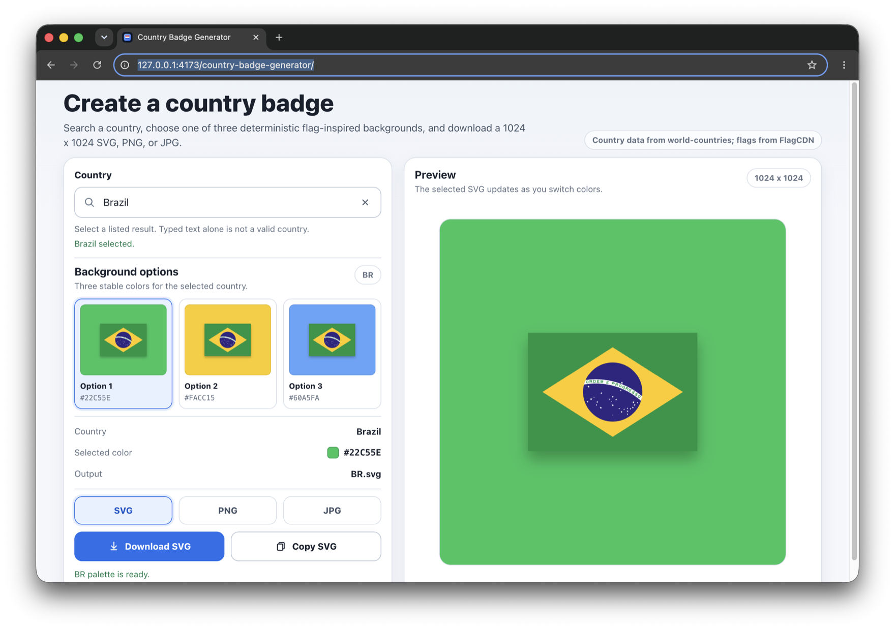
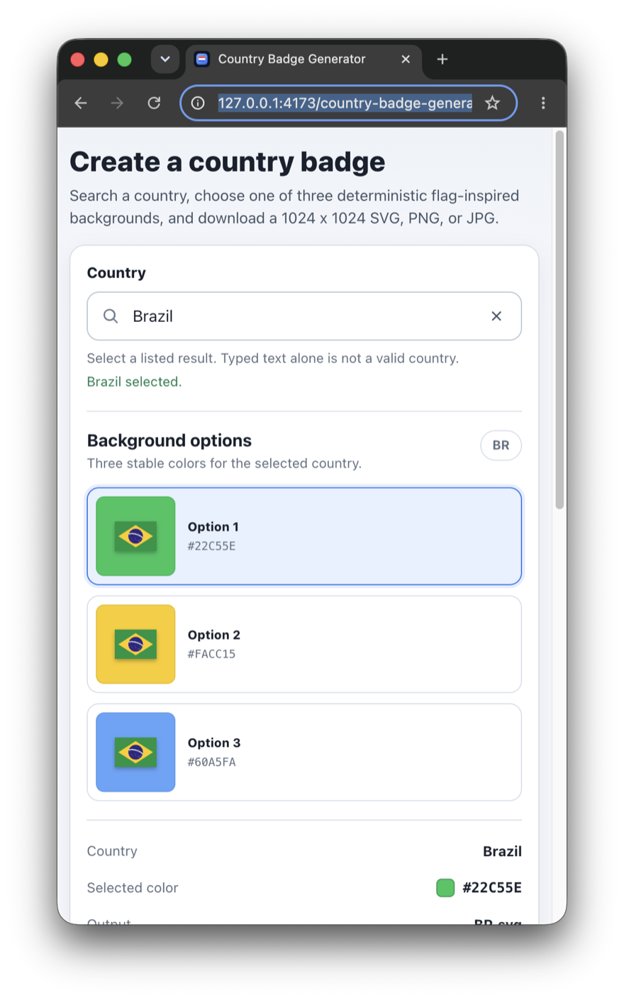

# Country Badge Generator

A fully static GitHub Pages app for creating square country badges. Search a country, select it from the combobox, compare three deterministic flag-inspired background colors, and download the selected 1024 x 1024 SVG, PNG, or JPG.

| Desktop | Mobile |
| --- | --- |
|  |  |

## Features

- Browser-side country search by English name, ISO alpha-2 code, and alternate spellings from the country data source
- Accessible combobox with pointer and keyboard navigation, and touch scrolling in the suggestion list
- Exactly three deterministic color options for each country, exposed as one exclusive radio group
- Pointer and arrow-key selection updates the preview immediately
- In-page recovery for a failed country list or a failed palette
- Manual SVG, PNG, and JPG download using filenames such as `BR.svg`, `BR.png`, and `BR.jpg`
- Copy the current SVG to the clipboard when the browser allows it
- Self-contained exported SVG with embedded flag artwork
- Compact responsive interface for desktop and mobile
- Static HTML, CSS, and native ES modules

## Deterministic Palette

Every background is chosen from a fixed curated catalog of colors declared in `js/palette-policy.js`.
The flag decides which catalog entries are chosen, never the color values themselves.

The work is split across three modules: `js/palette-sampler.js` reads the flag in the browser and
reports the colors it observed, `js/palette-policy.js` decides which curated colors represent them
without touching the DOM, and `js/palette.js` is the facade that joins the two.

1. The selected flag SVG is fetched in the browser.
2. The flag is rasterized into a small offscreen canvas sized from its aspect ratio.
3. Every second pixel is sampled, pixels below the alpha threshold are ignored, and the remaining
   channels are quantized into a weighted histogram.
4. Histogram entries are ranked by coverage, near-black and near-white tones are down-ranked,
   saturated tones are favored, perceptually close entries are merged by OKLab distance, and at most
   eighteen source colors are kept.
5. Each source color is classified into a hue family, or into `light` or `dark` when it has too
   little saturation. Saturation-weighted family totals then select up to three target families,
   collapsing near-duplicate families and adding a related family or a light tint when the flag
   yields too few.
6. For each target, the curated candidates of that family and its alternates are scored on family
   match, the family's planned tone order, family weight, proximity to the source colors, contrast
   against them, and a penalty for OKLab closeness to the options already selected.
7. The highest-scoring candidate wins each target, with ties broken by catalog order.

For the same fetched flag asset and the same curated catalog, a country always produces the same
three colors in the same order. No randomness, date, time, locale, user state, backend, or secrets
affect the palette. A result can change when the upstream flag artwork changes, when the curated
catalog is revised, or when a browser rasterizes the same flag differently.

## Data Sources

- Country data: [`world-countries` 5.1.0 via jsDelivr](https://cdn.jsdelivr.net/npm/world-countries@5.1.0/dist/countries.json)
- Country data license: [ODbL](https://cdn.jsdelivr.net/npm/world-countries@5.1.0/LICENSE)
- Flag SVGs: [FlagCDN](https://flagcdn.com/)

Both remote sources are requested directly from the browser, require no API key, and return CORS-compatible responses. The app does not keep a full country list or flag set in the repository.

## Local Development

Requirements:

- Node.js 24
- npm
- Network access for the initial country catalog, uncached flags, and the first Playwright browser installation

Install the exact development dependencies and Chromium for Testing:

```bash
npm ci
npx playwright install chromium
```

Serve the app over HTTP:

```bash
npm start
```

Open:

```text
http://localhost:8080
```

Do not test the app from `file://`; native ES modules and browser security behavior differ from the deployed site.

## Tests

```bash
npm run test:unit
npm run test:browser
npm test
```

Browser tests serve the checkout through a temporary directory under the
`/country-badge-generator/` path segment, on a port chosen at run time:

```text
http://127.0.0.1:<port>/country-badge-generator/
```

That mirrors the GitHub Pages repository subpath without depending on the checkout directory's own
name, so the suite runs from a Git worktree and from two checkouts at the same time.

Browser acceptance targets the Playwright-owned Chromium for Testing build. Brave, Gecko, WebKit,
and installed branded Chrome builds are not acceptance targets.

## Screenshots

```bash
npm run screenshots
```

The published images are captured from real browser windows, never rendered offscreen, so the
macOS window shadow, rounded corners and elevation are part of the image. The script launches the
browser itself, resolves that window's id from its own process id, and captures it with
`screencapture -l`. It needs a Retina display, Screen Recording permission for the terminal running
it, and `cwebp`. The method and the reason for each step are documented at the top of
[`scripts/capture-screenshots.mjs`](./scripts/capture-screenshots.mjs).

## Privacy and Security

- Badge generation and export run entirely in the browser.
- The browser requests country data from jsDelivr and flag SVGs from FlagCDN.
- The app uses `sessionStorage` for the normalized country catalog and up to eight recent country codes.
- The project has no account, analytics, backend, environment variables, API keys, or application secrets.
- Clipboard writes occur only after the user selects **Copy SVG** and remain subject to browser permission.

## Limitations

- The initial country catalog and uncached flags require network access.
- Availability and CORS behavior of the two documented data sources remain external dependencies.
- Browser behavior outside the recorded Chromium acceptance target is unverified.
- The interface commits to one light visual direction; a dark colour-scheme preference is honored
  by keeping the page light rather than by a separate dark theme.

## Project Contract

See [`docs/product.md`](./docs/product.md) for the product boundary and [`AGENTS.md`](./AGENTS.md)
for repository policy, validation, and contribution rules.

## GitHub Pages Deployment

The project is designed for GitHub Pages at:

```text
https://martonpaulo.github.io/country-badge-generator/
```

Deployment requirements:

- Serve files directly from the repository root.
- Keep `.nojekyll` in place.
- Keep all local asset and module paths relative, such as `./js/app.js`.
- Do not add server functions, backend routes, environment variables, API keys, secrets, SSR, or routing rewrites.

## Repository Structure

```text
.
|-- assets/
|   `-- favicon.svg
|-- css/
|   `-- styles.css
|-- js/
|   |-- app.js
|   |-- countries.js
|   |-- country-service.js
|   |-- flag-service.js
|   |-- palette.js
|   `-- svg.js
|-- tests/
|   |-- browser/
|   `-- unit/
|-- .nojekyll
|-- index.html
|-- package.json
`-- playwright.config.js
```

## Error Behavior

- If country data cannot load, the combobox stays disabled and the page shows an explicit error.
- If a query has no results, the dropdown shows a no-results state.
- Free text is never treated as a valid country.
- If a flag cannot load, is blocked by CORS, or returns malformed SVG, generation fails with an explicit status message.
- If canvas is unavailable, palette generation fails with an explicit status message.
- If image export is unavailable, PNG and JPG downloads fail with an explicit status message.
- If clipboard write is unavailable or blocked, the app reports the copy failure without affecting manual download.
