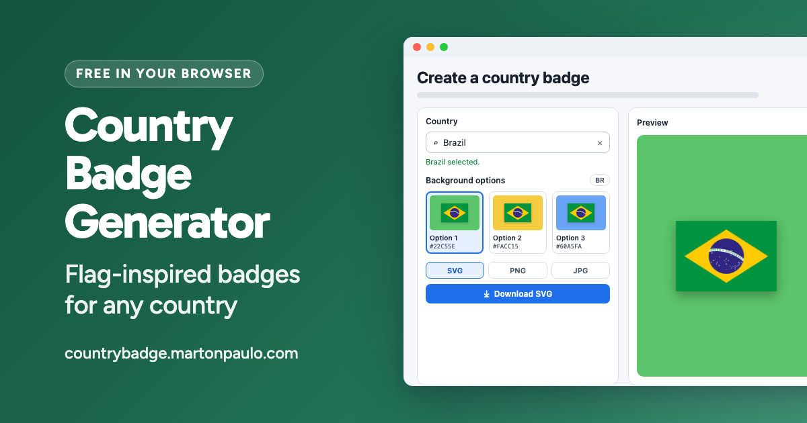

<div align="center">



# Country Badge

Create square country badges with three deterministic, flag-inspired background colors and download each one as SVG, PNG, or JPG.

[](https://github.com/martonpaulo/country-badge/actions/workflows/validate.yml) [](https://github.com/martonpaulo/country-badge/actions/workflows/browser.yml) [](https://nodejs.org/) [](https://playwright.dev/)

</div>

Country Badge is a **fully static GitHub Pages app**: search a country, select it from the
accessible combobox, compare the three flag-inspired background colors it offers, and download the
selected **1024 × 1024** badge as SVG, PNG, or JPG. Everything — the search, the palette, the
rasterization and the export — happens **in the browser**.

The colors are **deterministic, never random**. Each one is a curated catalog entry chosen by what
the country's own flag contains, so the same flag and the same catalog always produce the same three
options in the same order. There is **no backend, no account, no analytics and no API key**: the two
remote sources are read directly from the browser and nothing about a visit is stored anywhere but
their own `sessionStorage`.

---

<br />

## 🌱 Quick Start

```bash
npm ci
npx playwright install chromium
npm start
```

Then open `http://localhost:8080`.

Prerequisites: **Node.js 24**, npm, and network access for the initial country catalog, uncached
flags, and the first Playwright browser installation. Do not test the app from `file://`; native ES
modules and browser security behavior differ from the deployed site.

<br />

## 🛠 Commands

| Command | What it does |
| --- | --- |
| `npm start` | Serves the repository root over HTTP on port 8080 (`python3 -m http.server`) |
| `npm test` | The unit suite followed by the browser suite |
| `npm run test:unit` | `node --test` over `tests/unit/` |
| `npm run test:browser` | The Playwright acceptance suite |
| `npm run social-card` | Renders `design/social-card/social-card.html` into `social-card.jpg` (on a Mac) |

Browser tests serve the checkout at the site root on a port chosen at run time
(`http://127.0.0.1:<port>/`). That mirrors the published origin, and the run-time port lets two
checkouts run the suite at the same time. Browser acceptance targets the Playwright-owned Chromium
for Testing build; Brave, Gecko, WebKit, and installed branded Chrome builds are not acceptance
targets.

<br />

## 🔐 Secrets and variables

The project reads **none**. There is no environment variable, no `.env` file, no GitHub Actions
secret, no API key and no application credential anywhere in this repository — both data sources are
public, CORS-enabled, and require no authentication.

---

<br />

## Features

- Browser-side country search by English name, ISO alpha-2 code, and alternate spellings from the country data source
- Accessible combobox with pointer and keyboard navigation, and touch scrolling in the suggestion list
- Exactly three deterministic color options for each country, exposed as one exclusive radio group
- Pointer and arrow-key selection updates the preview immediately
- In-page recovery for a failed country list or a failed palette
- Manual SVG, PNG, and JPG download using filenames such as `BR.svg`, `BR.png`, and `BR.jpg`
- Copy the current SVG to the clipboard when the browser allows it
- Self-contained exported SVG with embedded flag artwork
- Compact responsive interface for desktop and mobile
- Static HTML, CSS, and native ES modules

<br />

## Deterministic palette

Every background is chosen from a fixed curated catalog of colors declared in `js/palette-policy.js`.
The flag decides which catalog entries are chosen, never the color values themselves.

The work is split across three modules: `js/palette-sampler.js` reads the flag in the browser and
reports the colors it observed, `js/palette-policy.js` decides which curated colors represent them
without touching the DOM, and `js/palette.js` is the facade that joins the two.

1. The selected flag SVG is fetched in the browser.
2. The flag is rasterized into a small offscreen canvas sized from its aspect ratio.
3. Every second pixel is sampled, pixels below the alpha threshold are ignored, and the remaining
   channels are quantized into a weighted histogram.
4. Histogram entries are ranked by coverage, near-black and near-white tones are down-ranked,
   saturated tones are favored, perceptually close entries are merged by OKLab distance, and at most
   eighteen source colors are kept.
5. Each source color is classified into a hue family, or into `light` or `dark` when it has too
   little saturation. Saturation-weighted family totals then select up to three target families,
   collapsing near-duplicate families and adding a related family or a light tint when the flag
   yields too few.
6. For each target, the curated candidates of that family and its alternates are scored on family
   match, the family's planned tone order, family weight, proximity to the source colors, contrast
   against them, and a penalty for OKLab closeness to the options already selected.
7. The highest-scoring candidate wins each target, with ties broken by catalog order.

For the same fetched flag asset and the same curated catalog, a country always produces the same
three colors in the same order. No randomness, date, time, locale, user state, backend, or secrets
affect the palette. A result can change when the upstream flag artwork changes, when the curated
catalog is revised, or when a browser rasterizes the same flag differently.

<br />

## Data sources

- Country data: [`world-countries` 5.1.0 via jsDelivr](https://cdn.jsdelivr.net/npm/world-countries@5.1.0/dist/countries.json)
- Country data license: [ODbL](https://cdn.jsdelivr.net/npm/world-countries@5.1.0/LICENSE)
- Flag SVGs: [FlagCDN](https://flagcdn.com/)

Both remote sources are requested directly from the browser, require no API key, and return
CORS-compatible responses. The app does not keep a full country list or flag set in the repository.

<br />

## Privacy and security

- Badge generation and export run entirely in the browser.
- The browser requests country data from jsDelivr and flag SVGs from FlagCDN.
- The app uses `sessionStorage` for the normalized country catalog and up to eight recent country codes.
- The project has no account, analytics, backend, environment variables, API keys, or application secrets.
- Clipboard writes occur only after the user selects **Copy SVG** and remain subject to browser permission.

<br />

## Error behavior

- If country data cannot load, the combobox stays disabled and the page shows an explicit error.
- If a query has no results, the dropdown shows a no-results state.
- Free text is never treated as a valid country.
- If a flag cannot load, is blocked by CORS, or returns malformed SVG, generation fails with an explicit status message.
- If canvas is unavailable, palette generation fails with an explicit status message.
- If image export is unavailable, PNG and JPG downloads fail with an explicit status message.
- If clipboard write is unavailable or blocked, the app reports the copy failure without affecting manual download.

<br />

## Deployment

GitHub Pages publishes this repository directly. The deployment contract is:

- Serve files from the repository root.
- Keep `CNAME` in place, and keep `_config.yml`'s exclude list covering every file that must not reach the published site.
- Keep all local asset and module paths relative, such as `./js/app.js`.
- Do not add server functions, backend routes, environment variables, API keys, secrets, SSR, or
  routing rewrites.

<br />

## Project contract

See [`docs/product.md`](./docs/product.md) for the product boundary, [`AGENTS.md`](./AGENTS.md) for
repository policy and validation, and [`CONTRIBUTING.md`](./CONTRIBUTING.md) to report a bug or
propose a change.

---

<br />

## Limitations

- The initial country catalog and uncached flags require network access.
- Availability and CORS behavior of the two documented data sources remain external dependencies.
- Browser behavior outside the recorded Chromium acceptance target is unverified.
- The interface commits to one light visual direction; a dark colour-scheme preference is honored
  by keeping the page light rather than by a separate dark theme.

<br />

## License and attribution

[MIT](LICENSE) © 2026 Marton Paulo.

Country data is [ODbL](https://cdn.jsdelivr.net/npm/world-countries@5.1.0/LICENSE)-licensed and flag artwork comes from [FlagCDN](https://flagcdn.com/); both keep their own terms.
